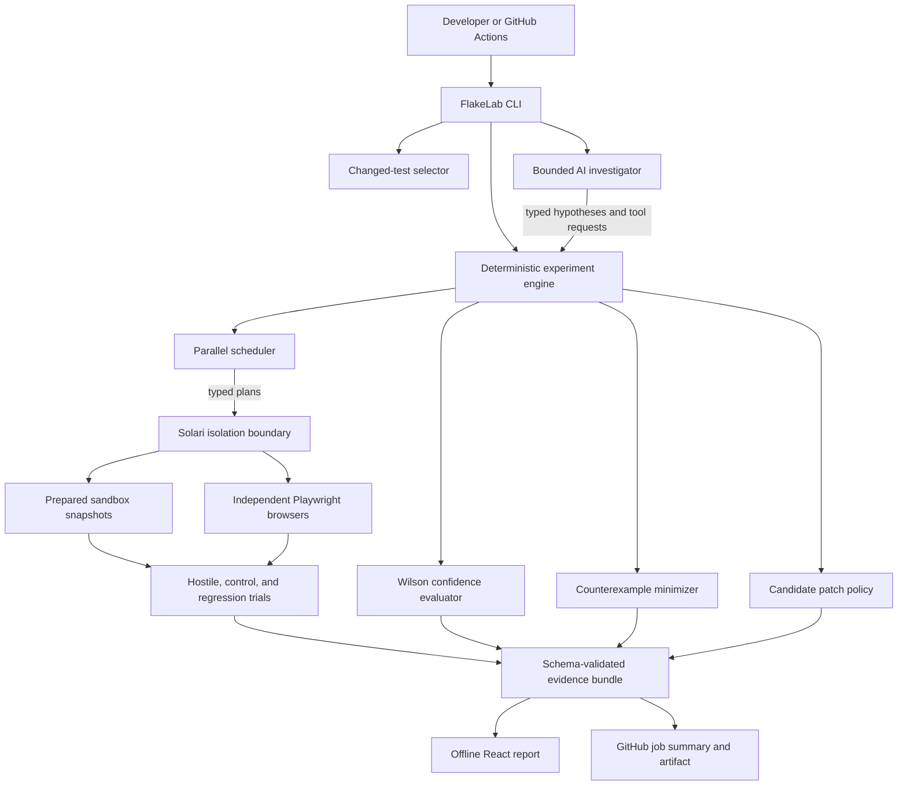
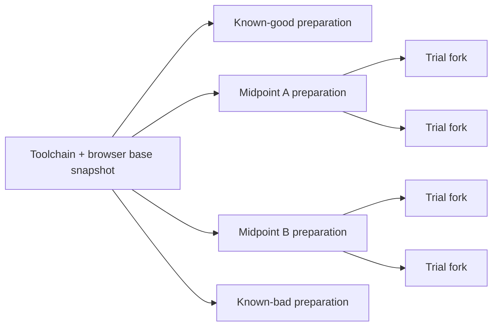

# FlakeLab architecture

FlakeLab separates judgment, measurement, and execution. The AI investigator may propose a cause
or patch, but only deterministic code may confirm it.

## Execution sequence

1. Select one Playwright test and establish a clean baseline.
2. Ask the investigator for competing, falsifiable hypotheses within a fixed budget.
3. Execute the chosen conditions in parallel and normalize outcomes into stable signatures.
4. Confirm only interventions whose measured confidence clears the configured threshold.
5. Minimize the confirmed trigger and serialize it as a portable YAML reproducer.
6. Let the model propose up to three exact application-source edits.
7. Reject unsafe or test-weakening edits before execution.
8. Copy the candidate into Solari and run typecheck, lint, hostile, control, and nearby regression
   proof without changing the developer checkout.
9. Redact and bundle the causal story, evidence, reproducer, patch, and proof into one HTML file.

## Statistical bisect topology

Each revision is archived locally without remotes or credentials, then built only inside Solari.
Repeated trials fork from the revision snapshot. Good and bad labels are measured, incompatible
historical builds remain visible, and an exact first-failing commit is emitted only when no skipped
revision hides the boundary.

## Persistence

Version one needs no database. Artifacts are JSON, NDJSON, YAML, diffs, traces, recordings, and one
self-contained HTML report under `.flakelab/` or explicit output paths. This keeps runs portable,
inspectable, easy to upload in CI, and simple to delete.
